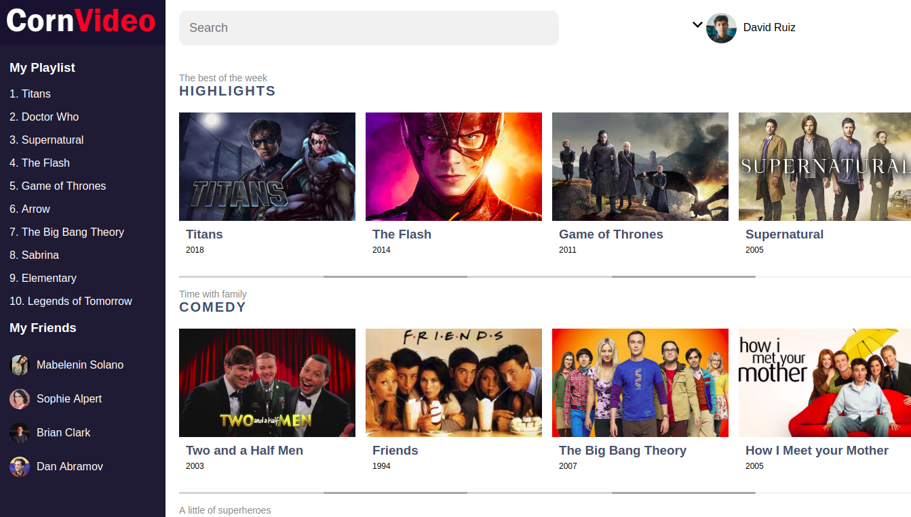

# CornVideo

CornVideo es una single page application en la que se puede reproducir videos online.

## Meta del proyecto

Este es un proyecto personal con el fin de profundizar en conceptos de desarrollo por componentes en React.js.

La caracteristica principal de este fue crear desde cero un reproductor de video haciendo funcional todos sus botones como Play/Pause, Volume, Fullscreen. 

## Proceso de desarrollo

CornVideo como una SPA creada bajo la libreria de React.js tiene como fin reproducir cualquier video online y tener acceso a las feautures que arroja la API de reproduccion de video de los navegadores en este caso Google Chrome.

Este ofrece una UI de usuario bastante agradable y fácil de usar para cualquier tipo de persona.

### Organización de Actividades

Se decidió desarrollarlo en tres partes diferentes.

- Sección de Categorias
- Menú de visualización de playlist.
- Reproductor de video.

Cada una de ellas contiene sus componentes inteligentes y también un modal para el reproductor.

### Creación de API

La data usada durante la aplicación y todos los recursos tanto de imagenes como videos, se almacenaron de manera estatiaca en una API la cual fue consumida desde React para hacer uso del contenido que esta trae.

### Añadiendo estilos a Componentes

Cada componente UI que se iba creando llevaba su correspondiente estilo basado en CSS3 para dar diseño a la UI de la aplicación.

Cada estilo fue separado por componentes para llevar un mayor orden dentro de la elaboración de la UI. Y fueron insertados en sus respectivos componentes funcionales.

> No se hizo uso de ningun pre-procesador de CSS como Stylus o SASS

### Deploy

Al tener toda la aplicación contruida en etapa de producción, se proceció a hacer un deploy de esta para poder ser hosteada en un servidor web públicamente.

## Resultado final

La meta del proyecto era bastante academica con el fin de aprender y fundamentar conceptos sobre el desarrollo de aplicaciones web en React. Se aprendieron las mejores practicas y los últimos features publicados por la comunidad de Facebook. 